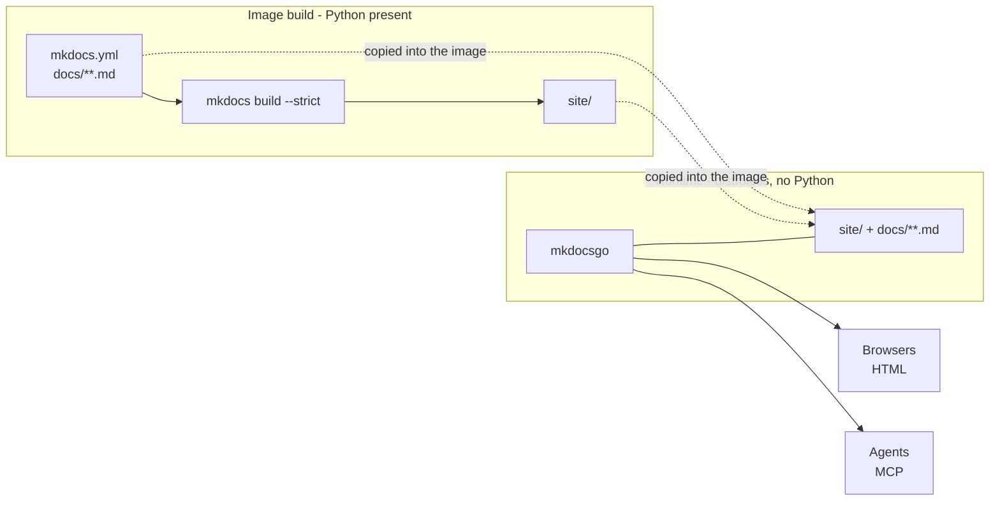
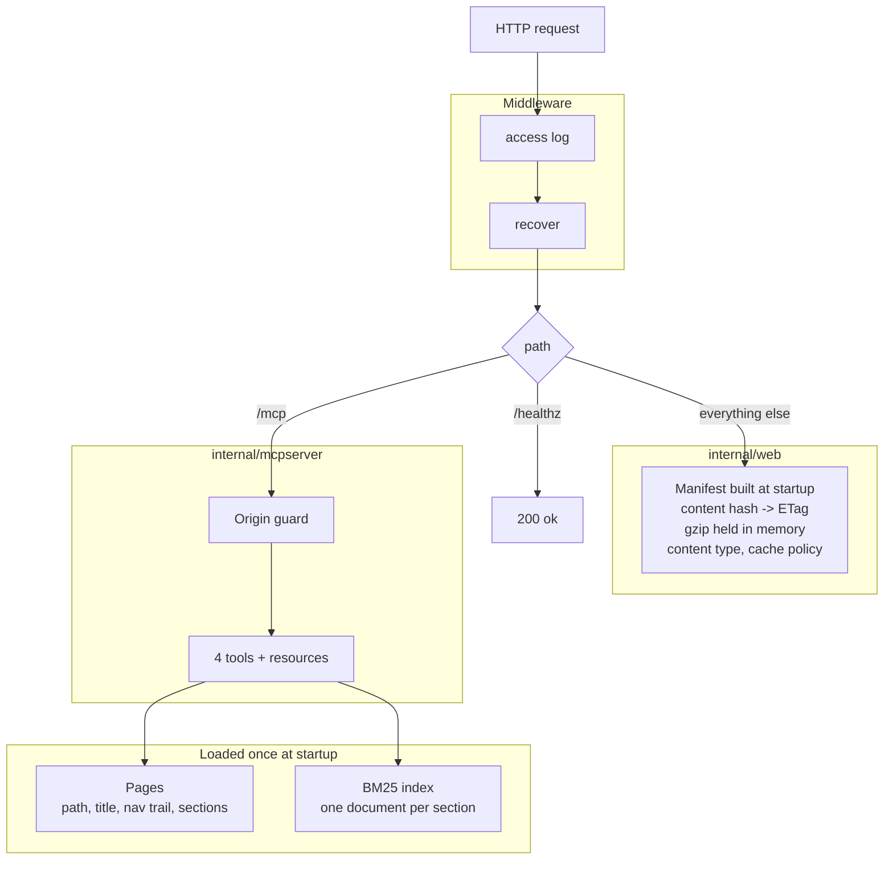
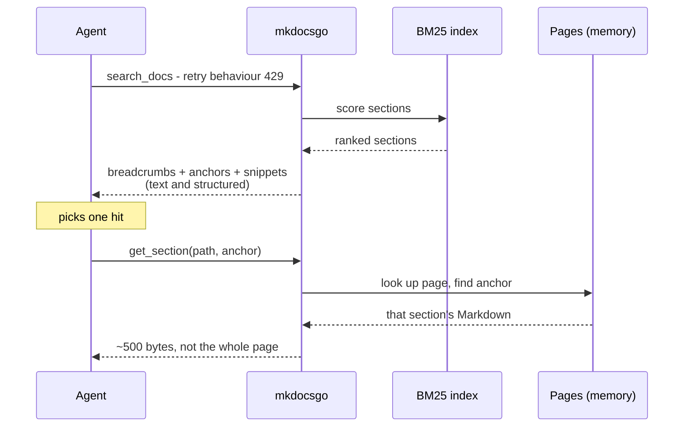

# Architecture

How the server works, where Python stops and Go starts, and what the
consolidation costs.

## The split

MkDocs is a Python program and stays one. It runs **once, at image build time**,
and turns Markdown into a static site. Everything after that is Go.

The Markdown sources travel into the runtime image alongside the built site,
because the MCP side indexes the author's original text rather than rendered
HTML. They are a fraction of the site's size.

## One process, two jobs

`/mcp` is an exact route and `/` a subtree, so the exact one wins even though
the site is mounted at the root. `-mode` decides which of the two branches is
registered at all: neither is a runtime check.

## Startup

| Step              | What happens                                                 | Why it is not obvious                                                                                               |
|-------------------|--------------------------------------------------------------|---------------------------------------------------------------------------------------------------------------------|
| Read `mkdocs.yml` | Decoded into a `yaml.Node`                                   | A plain map loses nav ordering, and `mkdocs.yml` routinely carries `!!python/name:` tags that break strict decoding |
| Resolve pages     | Walk `docs_dir`, apply `exclude_docs`, map `nav:` onto files | Gives every page a title and a breadcrumb; pages absent from nav are kept but flagged `in_nav: false`               |
| Split pages       | Strip front matter, cut at ATX headings                      | Fenced code blocks are tracked, so a `# comment` in a shell example is not mistaken for a heading                   |
| Compute anchors   | Reproduce Python-Markdown's `toc` slug                       | So a returned anchor is the same fragment the published site uses                                                   |
| Build the index   | One BM25 document per section, heading terms weighted        | Sections, not pages, are what an agent should receive                                                               |
| Index the site    | Hash every file, compress what compresses                    | The hash becomes the ETag; compressing once beats compressing per request                                           |

Everything above is immutable afterwards, so both halves are read concurrently
without locking.

## Serving a question

Two round trips, and the agent pays for one section instead of a page that may
run to thousands of lines.

## Integration with MkDocs

**What it reads.** `mkdocs.yml` - `site_name`, `docs_dir`, `exclude_docs`,
`nav` - every `.md` under `docs_dir`, and the built `site/`.

**What it does not do.** It never runs MkDocs. No plugins load, no macros
evaluate, no HTML renders. It reads sources and serves a finished build.

That buys a single static binary with no Python at run time. It costs three
things, all worth knowing:

| Consequence                              | Detail                                                                                                                                                                                                                                                                                           |
|------------------------------------------|--------------------------------------------------------------------------------------------------------------------------------------------------------------------------------------------------------------------------------------------------------------------------------------------------|
| Plugin-generated content is not expanded | A `--8<-- "examples/report-ok.json"` include is served and indexed **literally** by the MCP side. The referenced file's content is never searched, because MkDocs would have inlined it and this server does not run MkDocs. The *site* is unaffected: MkDocs already expanded it when building. |
| Anchors are a reimplementation           | They match Python-Markdown today, verified against a built site, but can drift. `cmd/anchorcheck` exists to catch that.                                                                                                                                                                          |
| Everything is read once                  | Editing a page changes nothing until a restart - which is the same lifecycle as the image carrying it.                                                                                                                                                                                           |

## What consolidation costs

Running the site and MCP in one process is a deliberate trade.

**Gained.** One artifact, one version, one deployment. The image drops from
~77 MB (nginx + alpine + content) to about 22 MB (distroless 2 MB + binary
8.5 MB + site 7.2 MB + Markdown sources 4 MB, measured on a real project). No nginx configuration to keep correct. ETags stable across replicas.

**Paid.** Shared fate: a failure in the search path is a failure in the process
serving the documentation. Three things reduce it to an acceptable level -
panics are recovered per request, search results and query length are capped,
and the MCP half never writes anything.

If that trade is not worth it for a given deployment, `-mode site` and
`-mode mcp` run the same binary as two processes with separate failure
domains, at the cost of a second deployment.

## Packages

| Package              | Responsibility                                                  |
|----------------------|-----------------------------------------------------------------|
| `internal/web`       | Site manifest, ETags, gzip, security headers, cache policy, 404 |
| `internal/mkdocs`    | Configuration, navigation, Markdown sectioning, anchors         |
| `internal/index`     | Tokeniser, BM25 index, snippet extraction                       |
| `internal/mcpserver` | Tool and resource definitions, payload shapes, error wording    |
| `cmd/mkdocsgo`       | Flags, modes, routing, middleware, shutdown                     |
| `cmd/anchorcheck`    | Compares computed anchors against a built site                  |

The dependency direction is one way: `mcpserver` uses `mkdocs` and `index`;
`web` knows about neither; none of the three knows MCP or HTTP routing exists
above it. Swapping the protocol layer, or reusing the indexer elsewhere,
touches nothing below it.

## Cost at rest

For a documentation set of tens of pages: startup is well under a second,
including hashing and compressing the site. A 77-file, 6.9 MB site holds 1.6 MB
of gzipped copies in memory; the section index for 80 sections is negligible
beside it. The process fits comfortably where an nginx container did.
